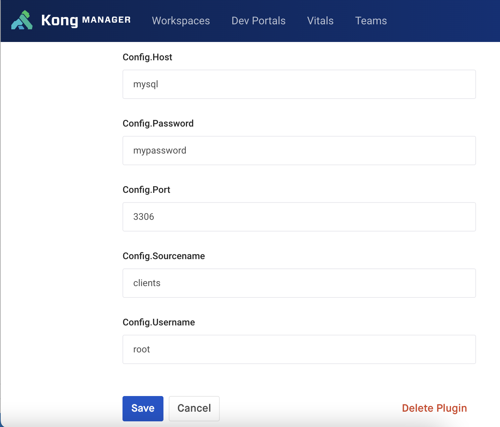

# Kong plugin to access to Database
This plugin uses the Lua library `luasql.mysql`


## What does the plugin?
1) Get a JWT from ```Authorization: Bearer````
2) Extract from JWT a claim
3) Make a SQL query in the DB with claim in where clause

## Plugin configuration for DB connection
